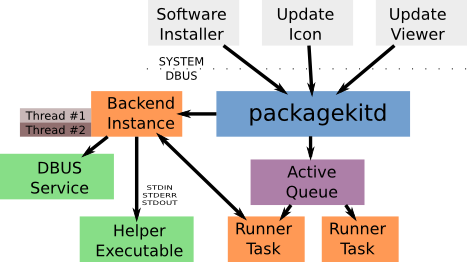

Title: PackageKit Introduction

PackageKit is a D-Bus abstraction layer that allows the session user
to manage packages in a secure way using a cross-distro, cross-architecture API.
PackageKit is built using a lightweight backend architecture.
PackageKit is product and vendor neutral and is currently being developed by a small team
of developers.

## Overall Description

PackageKit is a small open source system that abstracts out common package
management tasks such as:

- Checking for updates and installing them in the background.

- Automatically installing new or add-on software.

PackageKit has a modular design with an asynchronous API for client programs,
a flexible queuing module, and run-time selectable backends.

## Backends

A backend is just a compiled `.so` object that is
loaded at run-time and provides an interface to the underlying package
commands.
A backend converts an asynchronous request into either a new thread
in the same process, or executes external "glue" files that
can be written in any language.

Backends do not have to support all of the commands supported
by PackageKit. Each backend advertises the commands and
options it supports, and the frontend will only show UI
elements for those commands.
