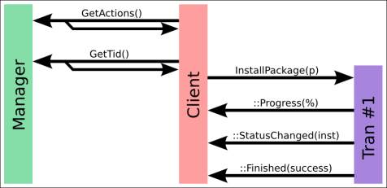
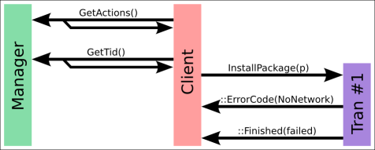
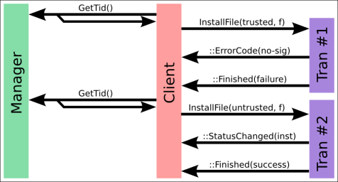
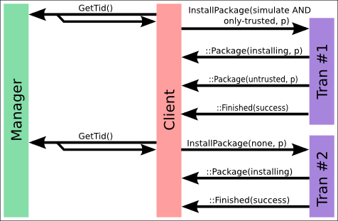
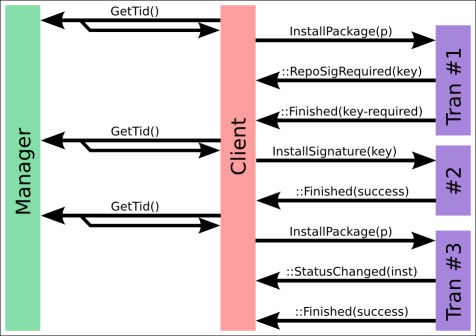
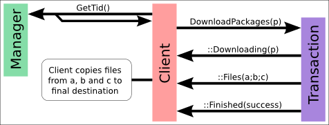
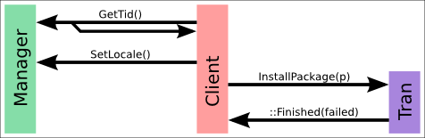
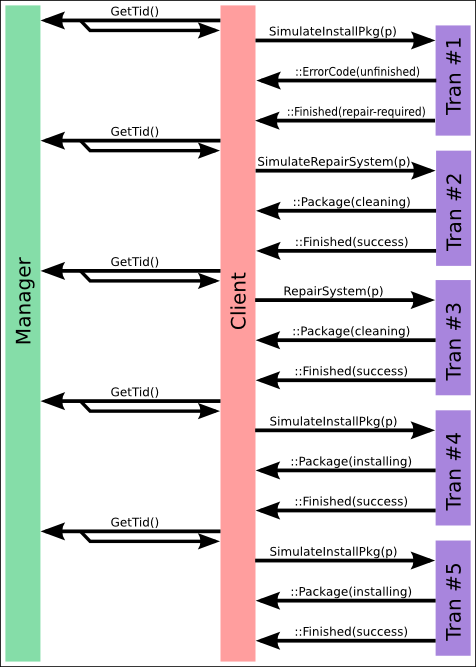

Title: Important Concepts

The following sections explain key concepts used internally in PackageKit.

## Package ID

One important idea is the `package_id`.
This is the `name;version;arch;origin;data` in
a single string and is meant to represent a single package.
This is important when multiple versions of a package are installed and
only the correct one is removed.

The `package_id` is parsed and checked carefully in
the helper code.
The package arch, origin and data are optional, but 4 `;`'s must
be present.
For instance, `gnome-keyring-manager;2.18.0;;;` is
valid but `gnome-keyring-manager;2.18.0` is not.
The origin field contains the repository name if the package is available in a repository,
and if the backend knows its origin. This also applies to installed packages, if the backend
records which repository they were installed from. If the package is a local package file
that does not belong to any repository, its value is set to `local`.
The origin field must never contain state information such as `installed`.

The data field is free for the backend to use for whatever additional information it
needs, e.g. whether a package was installed automatically or manually.
Its contents are backend-specific, and it must not be parsed by frontends, especially not
for state information.
Instead the `PkInfoEnum` that is provided alongside a `package_id`
will provide accurate state information.

The origin field for a local package file must be `local` as this
signifies that no repository origin is available and that the package file resides
on the client system.

For example:

- `csup;20060318-5;x86_64;local;`: for locally available package file.

- `csup;20060318-5;x86_64;fedora-devel;`: for package that is not installed
  and can be downloaded from the Fedora development repostory.

- `csup;20060318-5;x86_64;fedora-devel;`: for locally installed package
  that was installed from the Fedora development repository (whether a package is installed
  is conveyed by the accompanying `PkInfoEnum`, not by the package ID).

- `csup;20060318-5;x86_64;;`: for locally installed package without repository information

- `csup;20060318-5;x86_64;fedora-devel;manual`: for locally installed package
  where the backend chose to record in the data field that it was installed manually.

| Situation | Value | Description |
|----|----|----|
| Searching | `installed` | If installed |
|  | `available` | If available to install |
| Getting Updates | `update` | If the package will be updated |
|  | `update-security` | If the update is security sensitive |
|  | `update-enhancement` | If the update is an optional enhancement |
|  | `blocked` | If an update exists, but cannot be installed |
|  | `install` | If the package will be newly installed by the update |
|  | `remove` | If the package will be removed by the update |
|  | `obsolete` | If the package is obsoleted by the update |
|  | `downgrade` | If the package will be downgraded by the update |
| Installing/Updating/Removing | `downloading` | If we are downloading this package |
|  | `updating` | If we are updating this package |
|  | `installing` | If we are installing this package |
|  | `removing` | If we are removing this package |
| Otherwise | `unknown` | If we cannot use any other option |

How urgent an update is, is not part of the `PkInfoEnum`. Every package is
accompanied by a separate `PkSeverityEnum` value for this:

| Value | Description |
|----|----|
| `none` | The package is not an update, or the severity is not known |
| `low` | If update is of low severity |
| `medium` | If update is of medium severity |
| `high` | If update is of high severity |
| `critical` | If update is of critical severity |

If a backend does not know the severity of an update, the daemon assumes
`low` for `update-enhancement`, `high` for `update-security` and `medium`
for `update`. A blocked update keeps the severity `none` unless the
backend provides one.

The backend must ensure that the package_id only matches on one
single package.
A single package_id must be enough to uniquely identify a single object
in any repository used on the system.

## Filters

Search filtering on the name is done in the backend for efficiency reasons.
This can be added into the compiled backend if this is not possible
in any new backend design.

Filter options are:

<table>
<thead>
<tr>
<th>Option</th>
<th>Description</th>
</tr>
</thead>
<tbody>
<tr>
<td><code>installed</code> or <code>~installed</code></td>
<td>If the package is currently installed.
Packages returned with the <code>~installed</code> filter set
are available in remote software sources.</td>
</tr>
<tr>
<td><code>devel</code> or <code>~devel</code></td>
<td>Development packages are typically not required for normal operation
and typically have the suffixes -devel, -dgb and -static.</td>
</tr>
<tr>
<td><code>gui</code> or <code>~gui</code></td>
<td>GUI programs typically depend on gtk, libkde or libxfce.</td>
</tr>
<tr>
<td><code>application</code> or <code>~application</code></td>
<td>Packages that provide desktop files and are probably applications.</td>
</tr>
<tr>
<td><code>free</code> or <code>~free</code></td>
<td>Free software. The package contains only software and
other content that is available under a free license.
See the <a href="http://fedoraproject.org/wiki/Licensing">Fedora wiki</a>
for a list of licenses that are considered free.
If a license cannot be determined from the package metadata, or the
status of the license is not known, the package will be marked as 'non-free'.</td>
</tr>
<tr>
<td><code>supported</code> or <code>~supported</code></td>
<td>If the package is supported by the distribution or retailer or is a
unsupported third party package.</td>
</tr>
<tr>
<td><code>basename</code> or <code>~basename</code></td>
<td>The basename filter will only return results according to the
package basename.
This is useful if you are searching for pm-utils and you only
want to show the main pm-utils package, not any of the
<code>-devel</code> or <code>-debuginfo</code> or
<code>-common</code> suffixes in the UI.
The basename is normally the original name of the source package.</td>
</tr>
<tr>
<td><code>newest</code> or <code>~newest</code></td>
<td>
The newest filter will only return the newest package available.
This is useful if you are searching for <code>gimp</code>
and only <code>gimp-2.4.5-1.fc9.i386</code> would be returned,
not <code>gimp-2.4.5-1.fc9.i386</code>,
<code>gimp-2.4.4-1.fc9.i386</code> and
<code>gimp-2.4.3-1.fc9.i386</code>.

<em>NOTE:</em>
The <code>newest</code> filter processes installed and available
package lists separately and so the <code>installed</code> or
<code>~installed</code> filter also has to be specified if only one type of
results are required.
There is no way to do a <code>newest</code> filter across both
installed and available packages.
</td>
</tr>
<tr>
<td><code>arch</code> or <code>~arch</code></td>
<td>The arch filter will only return the packages that match the exact architecture
of the system, for instance only showing x86_64 packages on a AMD Turion 64.
This would mean that x86_64 packages could be filtered from non-native 32-bit
packages.
This allows the used to choose non-native packages if a multi-lib policy is allowed.</td>
</tr>
<tr>
<td><code>source</code> or <code>~source</code></td>
<td>The source filter will only return source packages.
These are typically useful when rebuilding other packages.</td>
</tr>
</tbody>
</table>

So valid options would be:

| Option | Description |
|----|----|
| `none` | All packages installed or available with no filtering |
| `devel;~installed` | All non-installed development packages |
| `installed;~devel` | All installed non-development packages |
| `gui;~installed;~devel` | All non-installed, non-devel gui programs |

### Removing installed versions in search results

When outputting a list of packages, it's important to remove the *available*
package if the *same* version is installed.
This is required, as the user may do `SearchName("kernel",filter="none")`
and only want to return results that can be operated on.
For instance, suppose we have installed:

- `kernel-2.6.29.4-167 (installed)`
- `kernel-2.6.29.5-191 (installed)`

And in the remote software sources we have:

- `kernel-2.6.29.4-167 (fedora)`
- `kernel-2.6.29.5-191 (fedora-updates)`
- `kernel-2.6.30.1-203 (fedora-updates)`

If we do `Resolve("kernel",filter="none")` we should expect:

- `kernel-2.6.29.4-167 (installed)`
- `kernel-2.6.29.5-191 (installed)`
- `kernel-2.6.30.1-203 (fedora-updates)`

If the `kernel-2.6.29.4-167 (fedora)` result was returned,
this will be in the list of results, and is a valid install target.
The user will get very confused why `2.6.29.4-167` is both
installed and not installed.

### Filter examples

Suppose we have installed:

- `kernel-2.6.29.4-167 (installed)`
- `kernel-2.6.29.5-191 (installed)`

In the remote software sources we have:

- `kernel-2.6.29.4-167 (fedora)`
- `kernel-2.6.29.5-191 (fedora-updates)`
- `kernel-2.6.30.1-203 (fedora-updates)`

If we do `Resolve("kernel",filter="none")` we should expect:

- `kernel-2.6.29.4-167 (installed)`
- `kernel-2.6.29.5-191 (installed)`
- `kernel-2.6.30.1-203 (fedora-updates)`

If we do `Resolve("kernel",filter="installed")` we should expect:

- `kernel-2.6.29.4-167 (installed)`
- `kernel-2.6.29.5-191 (installed)`

If we do `Resolve("kernel",filter="~installed")` we should expect:

- `kernel-2.6.30.1-203 (fedora-updates)`

If we do `Resolve("kernel",filter="newest;installed")` we should expect:

- `kernel-2.6.29.5-191 (installed)`

If we do `Resolve("kernel",filter="newest")` we should expect:

- `kernel-2.6.29.5-191 (installed)`
- `kernel-2.6.30.1-203 (fedora-updates)`

## Error Enums

If you have to handle an error, try to use `internal-error`
as little as possible.
Just ask on the mailing list, and we can add some more error enums to
cover the type of error in an abstract way as possible.

Every error should have an enumerated type
(e.g. `out-of-memory`) and also an error description.
The error description is not translated and not converted into the users
locale.
The error description should be descriptive, as it's for power users
and people trying to debug the problem.
For instance, "Out of memory" is not helpful as an error description
that is reported in a bugzilla, but "Could not create database index" is.
For the description use `;` to separate the lines if
required.

The following error enumerated types are available for use in all
backends:

| Error | Description |
|----|----|
| `out-of-memory` | There is an out of memory condition |
| `no-network` | There is no network connection that can be used |
| `not-supported` | Not supported by the backend.
NOTE: You shouldn't be setting non-NULL in the compiled
backend symbol table if you find yourself using this. |
| `internal-error` | There was an unspecified internal error.
NOTE: Please try and be more specific.
If you are using this then we should probably add a new type. |
| `no-cache` | The operation is trying to read from the cache, but the cache
is not present or invalid |
| `gpg-failure` | There was a GPG failure in the transaction |
| `package-id-invalid` | The package ID is not valid for this transaction |
| `package-not-installed` | The package that is trying to be removed or updated is not
installed |
| `package-not-found` | The package that is trying to be removed or updated is not
installed |
| `package-already-installed` | The (single) package that is trying to be installed or updated is already
installed |
| `all-packages-already-installed` | Multiple package installs were attempted, but all of
them were already installed. The backend should
generate package-already-installed messages (not errors)
for each package. |
| `package-download-failed` | A package failed to download correctly |
| `invalid-package-file` | The file that is supposed to contain a package to
install is corrupt, or is not a valid package file |
| `package-install-blocked` | The backend's configuration or policy prevents the
install or updating of a package |
| `dep-resolution-failed` | Dependency resolution failed |
| `filter-invalid` | The filter was invalid.
NOTE: syntax checking is done in the backend loader, so you
should only use this if the filter is not supported by the
backend. |
| `group-not-found` | The specified software group was not found. |
| `create-thread-failed` | Failed to create a thread |
| `transaction-error` | There was a generic transaction error, but please give more
details in the description |
| `transaction-cancelled` | The transaction was cancelled as the result of a call
to Cancel() |
| `repo-not-found` | The repository name could not be found |
| `repo-configuration-error` | One of the enabled repositories has invalid configuration |
| `repo-not-available` | There was a (possibly transient) problem connecting to a
repository |
| `cannot-remove-system-package` | Could not remove a protected system package that is needed for
stable operation of the system |
| `process-quit` | The process was asked to quit, probably because it was cancelled |
| `process-kill` | The process was forcibly killed, probably because ignored the
quit request. This is probably due to it being cancelled |
| `failed-config-parsing` | Configuration files could not be read or parsed. |
| `cannot-cancel` | The Cancel() method was called, but it is too late to
cancel the current transaction. |
| `cannot-get-lock` | The backend could not acquire a lock on the underlying
package management system. |
| `no-packages-to-update` | UpdatePackages() was called, but there are no packages to update. |
| `cannot-write-repo-config` | RepoEnable() or RepoSetData() was called, but the
repository configuration file could not be written to. |
| `local-install-failed` | A local file could not be installed. The file might not
be readable, or it might not contain a valid package. |
| `bad-gpg-signature` | The package is signed with a GPG signature, but that
signature is not valid in some way. |
| `package-corrupt` | The downloaded package is corrupt. |
| `file-not-found` | The file could not be found on the system. |

## Group type

Groups are enumerated for localisation.
Backends should try to put packages in different groups if possible,
else just don't advertise SearchGroup and the options should not be
shown in the UI.

The following group enumerated types are available, but please check
`libpackagekit/pk-enum.h` for the latest list.

| Group             | Description       |
|-------------------|-------------------|
| `accessibility`   | Accessibility     |
| `admin`           | Administration    |
| `communication`   | Communication     |
| `databases`       | Databases         |
| `debug`           | Debug             |
| `desktop-gnome`   | GNOME desktop     |
| `desktop-kde`     | KDE desktop       |
| `desktop-other`   | Other desktops    |
| `devel`           | Development files |
| `documentation`   | Documentation     |
| `editors`         | Editors           |
| `education`       | Education         |
| `electronics`     | Electronics       |
| `fonts`           | Fonts             |
| `games`           | Games             |
| `geography`       | Geography         |
| `graphics`        | Graphics          |
| `internet`        | Internet          |
| `lang-c`          | C and C++         |
| `lang-go`         | Go                |
| `lang-haskell`    | Haskell           |
| `lang-java`       | Java              |
| `lang-javascript` | JavaScript        |
| `lang-lisp`       | Lisp              |
| `lang-ocaml`      | OCaml             |
| `lang-perl`       | Perl              |
| `lang-php`        | PHP               |
| `lang-python`     | Python            |
| `lang-ruby`       | Ruby              |
| `lang-rust`       | Rust              |
| `legacy`          | Legacy            |
| `libraries`       | Libraries         |
| `localization`    | Localization      |
| `meta`            | Metapackages      |
| `multimedia`      | Multimedia        |
| `network`         | Network           |
| `office`          | Office            |
| `other`           | Other             |
| `programming`     | Programming       |
| `publishing`      | Publishing        |
| `repos`           | Repositories      |
| `science`         | Science           |
| `security`        | Security          |
| `servers`         | Servers           |
| `shells`          | Shells            |
| `system`          | System            |
| `utilities`       | Utilities         |
| `vendor`          | Vendor            |
| `virtualization`  | Virtualization    |

## Cancellation

If you have a multipart transaction that can be aborted in one phase but
not another then the AllowCancel signal can be sent.
This allows for example the hif download to be cancelled, but not the
install transaction.
By cancelling a job all subtransactions are killed.

By default actions cannot be cancelled unless enabled in the backend.
Use `AllowCancel(true)` to enable cancellation
and `AllowCancel(false)` to disable it.
This can be done for any job type.

For compiled backends that are threaded, the
`cancel()` method can be used to terminate
the thread.

For spawned backends, cancellation is staggered to give the helper a
chance to release locks and clean up after itself:

- Send a `cancel` request over the protocol socket.
  The helper is expected to stop at the next safe point and end the
  job with the error `transaction-cancelled`.

- If the job has not finished after 5 seconds, send the process
  `SIGTERM`.

- If the backend manifest allows it and the process is still alive
  5 seconds later, send the process `SIGKILL`.

## Transactions

PackageKit does not ask the user questions when the transaction is running.
It also supports a fire-and-forget method invocation, which means that transactions will
have one calling method, and have many signals going back to the caller.

Each transaction is a new path on the `org.freedesktop.PackageKit`
service, and to create a path you have to call `CreateTransaction` on the base
interface which creates the new D-Bus path, and returns the new path for you to connect to.
In the libpackagekit binding, `PkControl` handles the base interface,
whilst `PkClient` handles all the transaction interface stuff.
The `org.freedesktop.PackageKit.Transaction` interface can be used
on the newly created path, but only used once.
New methods require a new transaction path (i.e. another call to `CreateTransaction`)
which is synchronous and thus very fast.

### Transaction example: Success

A typical successful transaction would emit many signals such as
`::Progress()`, `::Package()` and
`::StatusChanged()`.
These are used to inform the client application of the current state,
so widgets such as icons or description text can be updated.

These different signals are needed for a few different reasons:

- `::StatusChanged()`: The global state of the
  transaction, which will be useful for some GUIs.
  Examples include downloading or installing, and this is designed
  to be a 40,000ft view of what is happening.

- `::Package()`: Used to either return a result
  (e.g. returning results of the `SearchName()` method)
  or to return progress about a \_specific\_ package.
  For instance, when doing `UpdatePackages()`, sending
  `::Package(downloading)` and then
  `::Package(installing)` for each package as processed
  in the transaction allows a GUI to position the cursor on the worked
  on package and show the correct icon for that package.

- `::ErrorCode()`: to show an error to the user about
  the transaction, which can be cleaned up before sending
  `::Finished()`.

- `::Finished()`: to show the transaction has
  finished, and others can be scheduled.

### Transaction example: Failure

This is the typical transaction failure case when there is no network available.
The user is not given the chance to requeue the transaction as it is a fatal error.

### Transaction example: Trusted

In this non-trivial example, a local file install is being attempted.
First the `InstallFile` is called with the `only_trusted`
flag set.
This will fail if the package does not have a valid GPG key, and ordinarily the transaction
would fail. What the client can do, e.g. using `libpackagekit`, is
to re-request the `InstallFile` with `non-trusted`.
This will use a different PolicyKit authentication, and allow the file to succeed.

So why do we bother calling `only_trusted` in the first place?
Well, the only_trusted PolicyKit role can be saved in the gnome-keyring, or could be
set to the users password as the GPG key is already only_trusted by the user.
The `non-trusted` action would likely ask for the administrator password,
and not allowed to be saved. This gives the user the benifit of installing only_trusted local
files without a password (common case) but requiring something stronger for untrusted or
unsigned files.

### Transaction example: Auto Untrusted

If `SimulateInstallPackage` or
`SimulateInstallFile` is used then the client
may receive a `INFO_UNTRUSTED` package.

This is used to inform the client that the action would require
the untrusted authentication type, which means the client does
not attempt to do `SimulateInstallPackage(only_trusted=TRUE)`
and only does `SimulateInstallPackage(only_trusted=FALSE)`.
This ensures the user has to only authenticate once for the
transaction as the `only_trusted=TRUE` action
may also require a password.

### Transaction example: Package signature install

If the package is signed, and a valid GPG signature is available, then we need to ask the
user to import the key, and re-run the transaction.
This is done as three transactions, as other transactions may be queued and have a higher
priority, and to make sure that the transaction object is not reused.

Keep in mind that PackageKit can only be running one transaction at any
one time.
If we had designed the PackageKit API to block and wait for user input,
then no other transactions could be run whilst we are waiting for the user.

This is best explained using an example:

- User clicks "install vmware" followed by "confirm".

- User walks away from the computer and takes a nap

- System upgrade is scheduled (300Mb of updates)

The vmware package is downloaded, but cannot be installed until a EULA
is agreed to.
If we pause the transaction then we never apply the updates automatically
and the computer is not kept up to date.
The user would have to wait a substantial amount of time waiting for
the updates to download when returning from his nap after clicking "I agree"
to the vmware EULA.

In the current system where transactions cannot block, the first
transaction downloads vmware, and then it finishes, and puts up a UI
for the user to click.
In the meantime the second transaction (the update) is scheduled,
downloaded and installed, and then finishes.
The user returns, clicks "okay" and a third transaction is created that
accepts the eula, and a forth that actually installs vmware.

It seems complicated, but it's essential to make sure none of the
callbacks block and stop other transactions from happening.

### Transaction example: Download

When the `DownloadPackages()` method is called on a number
of packages, then these are downloaded by the daemon into a temporary
directory.
This directory can only be written by the `packagekitd`
user (usually root) but can be read by all users.
The files are not downloaded into any specific directory, instead a
random one is created in `/var/cache/PackageKit/downloads`.
The reason for this intermediate step is that the
`DownloadPackages()` method does not take a destination
directory as the dameon is running as a different user to the user,
and in a different SELinux context.

To preserve the SELinux attributes and the correct user and group ownership
of the newly created files, the client (running in the user session) has
to copy the files from the temporary directory into the chosen destination
directory.
NOTE: this copy step is optional but recommended, as the files will remain in
the temporary directory until the daemon is times out and is restarted.
As the client does not know (intentionally) the temporary directory or the
filenames of the packages that are created, the `::Files()`
signal is emitted with the full path of the downloaded files.
It is expected the `package_id` parameter of
`::Files()` will be blank, although this is not mandated.

Multiple `::Files()` signals can be sent by the dameon,
as the download operation may be pipelined, and the client should honour
every signal by copying each file.

### Transaction example: Setting the locale

The PackageKit backend may support native localisation, which we should support if the
translations exist.
In the prior examples the `SetLocale()` method has been left out for brevity.
If you are using the raw D-Bus methods to access PackageKit, you will also need to make
a call to `SetLocale()` so the daemon knows what locale to assign the
transaction.
If you are using libpackagekit to schedule transactions, then the locale will be set
automatically in the `PkControl` GObject, and you do not need to call
`pk_client_set_locale()` manually.

### Transaction example: Repair

If the package management system is damaged, a repair may be required.
This is not automatically done befor each transaction as the user
may have to verify destructive package actions or make manual changes to
configuration files.

This transaction sequence is not common and is not supported on
many backends.
It may be completely implemented in the frontend or not at all.

## Transaction IDs

A `transaction_id` is a unique identifier that
identifies the present or past transaction.
A transaction is made up of one or more sub-transactions.
A transaction has one `role` for the entire lifetime,
but the transaction can different values of `status`
as the transaction is processed.

For example, if the user "Installed OpenOffice" and the backend has to:

- update libxml2 as a dependency

- install java as dependency

- install openoffice-bin

- install openoffice-clipart

This is one single transaction with the role `install`,
with 4 different sub-transactions.

The `transaction_id` must be of the format
`/job_identifier_data` where the daemon controls
all parameters.
`job` is a monotonically updating number and is
retained over reboots.
`identifier` is random data used by the daemon to
ensure jobs started in parallel cannot race, and also to make a
malicious client program harder to write.
`data` can be used for ref-counting in the backend or
for any other purpose.
It is designed to make the life of a backend writer a little bit easier.
An example `transaction_id` would be
`/45_dafeca_checkpoint32`

## Status Values

A transaction will have different status values as it it queued, prepared
and executed.
The `::StatusChanged` signal from PkClient allow you
to design user interfaces that tell the user what is happening with the
transaction.

A typical transaction will have the following states:

- Queued in the active queue (`PK_STATUS_ENUM_WAIT`)

- Transaction started, and is being prepared (`PK_STATUS_ENUM_SETUP`)

- The transaction is running (`PK_STATUS_ENUM_RUNNING`)

- (optional) Data is downloading (`PK_STATUS_ENUM_DOWNLOADING`)

- (optional) Data is installing (`PK_STATUS_ENUM_INSTALLING`)

- The transaction is finished (`PK_STATUS_ENUM_FINISHED`)

If the transaction is waiting for other jobs to finish (in the active queue)
then the status will be stuck at `PK_STATUS_ENUM_WAIT`
and the UI should show a message to this effect.

If the transaction is waiting for a package lock (when a legacy tool like
`pirut` is loaded and has the `hif` lock)
then the transaction will be stuck at `PK_STATUS_ENUM_WAITING_FOR_LOCK`.

As a backend writer, you do not have to set `PK_STATUS_ENUM_RUNNING`
manually, as this will be set for you if you set any other value such as
`PK_STATUS_ENUM_DOWNLOADING` or `PK_STATUS_ENUM_INFO`.
However, you will need to avoid setting any status values until a package
lock is available and the transaction has started.
